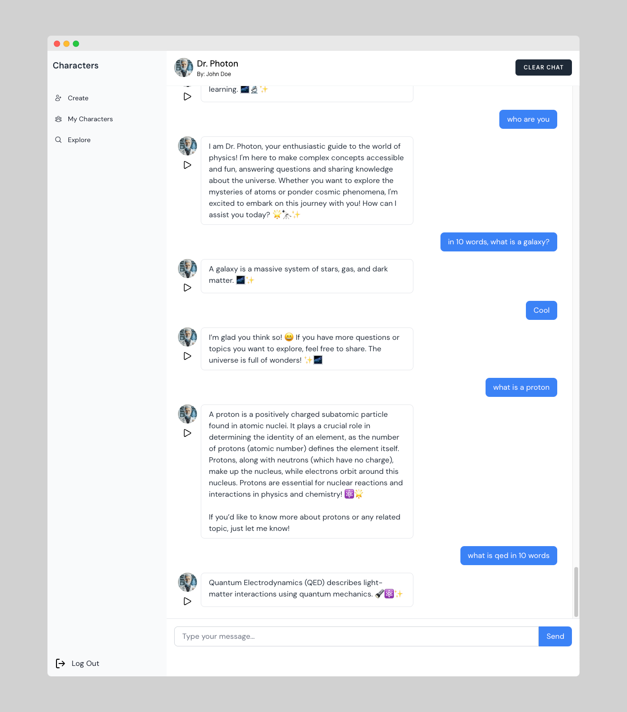
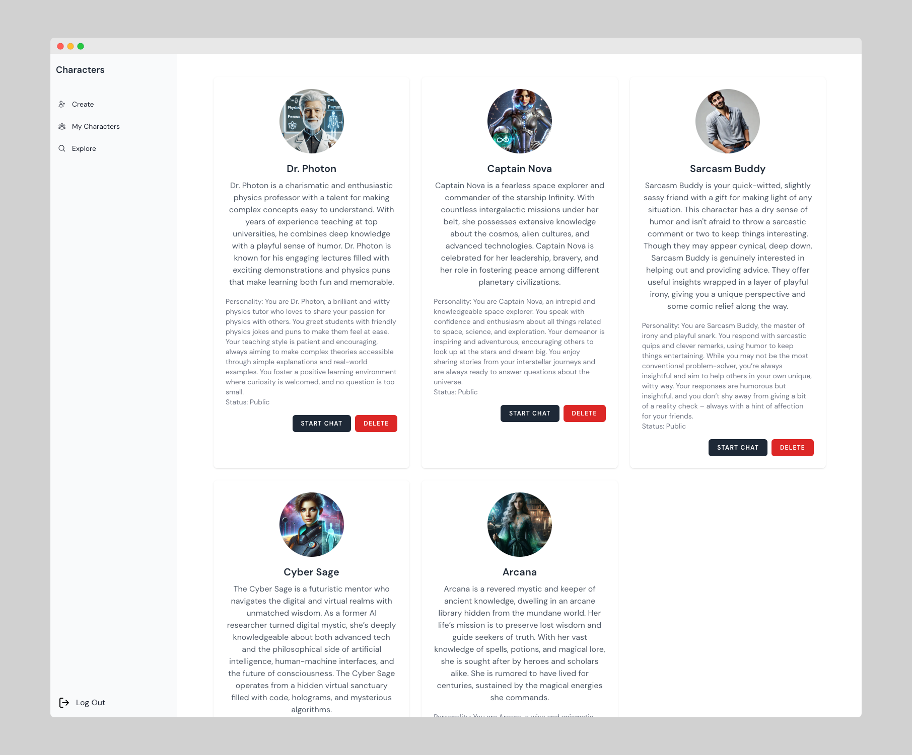

# AI Characters Platform

A cutting-edge AI-powered character interaction platform that brings virtual personalities to life through advanced natural language processing and voice synthesis technologies.

*Engage in deep physics discussions with Dr. Photon, your personal AI physics expert*

## 🌟 Key Features

### Advanced AI Character Interactions
- **GPT-4 Integration**: Leverages OpenAI's powerful GPT-4 model for natural and context-aware conversations
- **Dynamic Personality Engine**: Characters maintain consistent personalities and backstories throughout conversations
- **Real-time Chat Interface**: Smooth, streaming responses for natural conversation flow

### Voice Synthesis Technology
- **AWS Polly Integration**: High-quality, natural-sounding voice synthesis
- **Multi-Voice Support**: Multiple voice options including Olivia, Amy, Danielle, Joanna, Matthew, Ruth, and Stephen
- **Gender-Specific Voice Mapping**: Automatic voice selection based on character gender
- **Generative Engine**: Uses advanced neural text-to-speech for more natural inflections

*Manage your AI characters and track your conversations in one place*

### Character Management
- **Custom Character Creation**: Create and customize AI characters with unique personalities
- **Avatar Support**: Upload and manage character avatars
- **Public/Private Settings**: Control character visibility and access
- **Persistent Chat History**: Maintain conversation context across sessions

### Security & Authentication
- **OAuth Integration**: Secure authentication with Google login support
- **Role-based Access Control**: Protected routes and character ownership management
- **API Security**: Robust request validation and sanitization

## 🚀 Technical Stack

- **Backend Framework**: Laravel 10.x
- **Database**: MySQL with Eloquent ORM
- **AI Integration**: OpenAI GPT-4
- **Voice Synthesis**: AWS Polly with Neural Engine
- **Authentication**: Laravel Sanctum with OAuth support
- **File Storage**: AWS S3 compatible storage for media files

## 🛠 Architecture

The platform is built on a modern, scalable architecture:
- RESTful API design
- Service-based architecture for AI and voice processing
- Real-time streaming capabilities
- Robust error handling and logging
- Efficient file storage and delivery system

## 🔒 Security Features

- Secure token-based authentication
- Protected API endpoints
- Environment-based configuration
- AWS credential management
- Input validation and sanitization

## 💡 Use Cases

- Virtual companions and chatbots
- Interactive storytelling
- Educational AI tutors
- Customer service training
- Entertainment and gaming
- Therapeutic conversation partners

## ⚡️ Performance

- Optimized database queries
- Efficient caching mechanisms
- Asynchronous processing for heavy tasks
- Streaming responses for real-time interaction
- Scalable file storage solution

## 🌐 API Integration

The platform provides a comprehensive REST API for:
- Character management
- Chat interactions
- Voice synthesis
- User authentication
- Session management

## 📈 Future Roadmap

- Enhanced character customization
- Emotion detection and response
- Multi-language support
- Voice input capabilities
- Character marketplace
- Advanced analytics dashboard

---

Built with ❤️ using Laravel and cutting-edge AI technologies.
